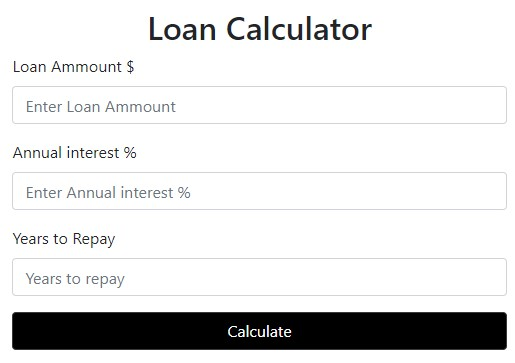
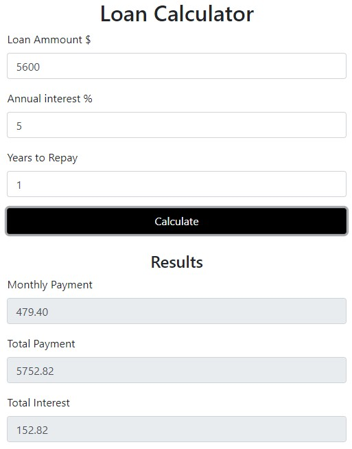

    

        <h1>
        Loan-Calculator
        </h1> 
        <h3>
            Simple HTML and JavaScript app that calculate the loan
        </h3>

        

            
        

        
        

            
        

        

            
        

        

            
        

       
    
